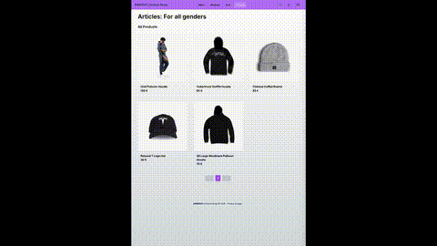

# 🛍️ E-Commerce Fashion Store

Welcome to **E-Commerce Fashion Store** — a modern online clothing store featuring an admin dashboard, user authentication, and PayPal payment integration.

## 🖼️ Preview

---

## ✨ Key Features

- 👤 Customer registration and login
- Modification of shipping data
- 🛒 Persistent shopping cart
- 📦 Order management/Check out
- 💳 PayPal payment integration
- 🛠️ **Admin Dashboard**:
  - Create/Edit products
  - Manage orders and users

---

## ⚙️ Technologies Used

- **Framework**: Next.js 14
- **Database & ORM**: Prisma ORM + PostgreSQL _(or your DB of choice)_
- **Authentication**: NextAuth.js (v5)
- **Validation**: Zod
- **Global state**: Zustand
- **Styling**: Tailwind CSS

## 🚀 How to Run This Project

1. Clone the repository.
2. Create a copy of the file `.env.template` and rename it to `.env`, and modify the environmet variables.
3. Install dependencies: `npm install`
4. Launch the DB: `docker compose up -d`
5. Run prisma's migrations: `npx prisma migrate dev`
6. Execute command SEED `npm run seed`
7. Launch the application: `npm run dev`
